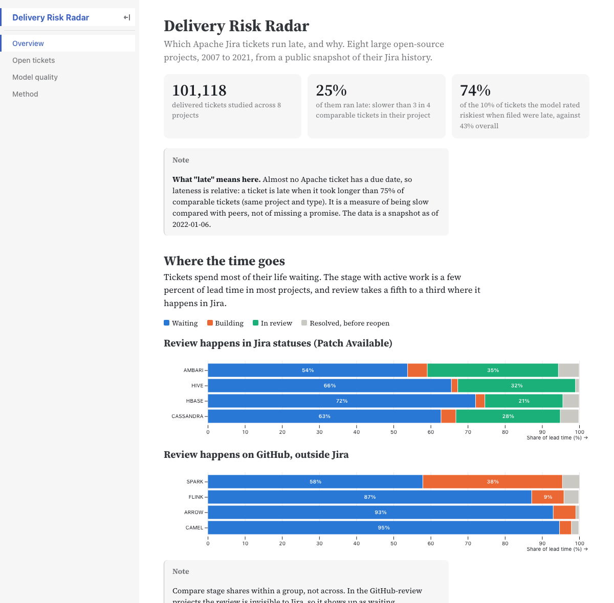
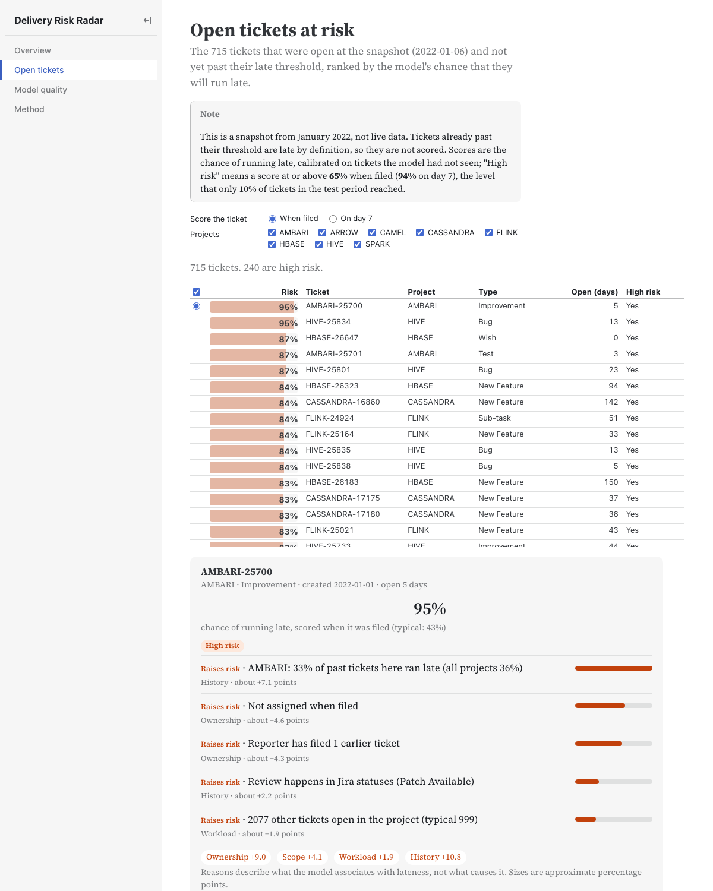
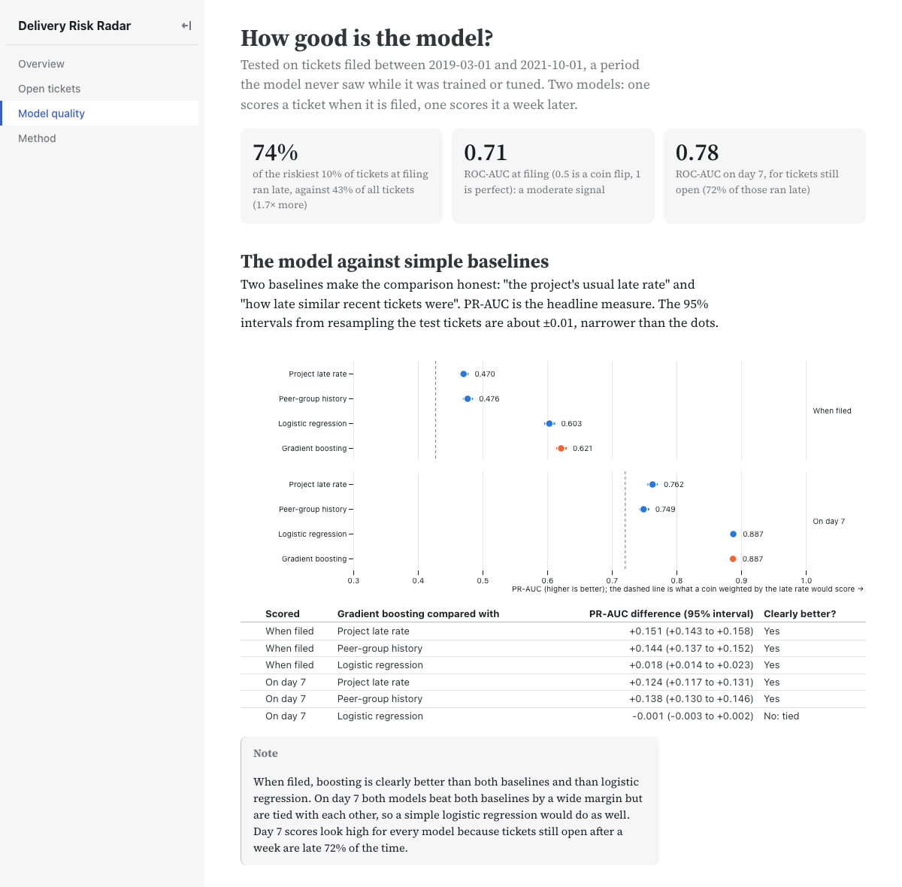

# Delivery Risk Radar

An analytics-first look at Jira data: **which tickets will run late, and why.** Built on the public Apache Jira history (1.01 million tickets), with a SQL analysis of where delivery time goes, a calibrated prediction model, plain-English reasons for every prediction, and a static dashboard.



## Headline results

Tested on 31,000 tickets filed between March 2019 and October 2021, a period the model never saw while it was trained or tuned. "Late" means slower than 75% of comparable tickets (same project and type), because almost no Apache ticket has a due date.

| | Baseline (project's usual late rate) | Model |
|---|---|---|
| **At filing:** ROC-AUC | 0.56 | **0.71** |
| **At filing:** the riskiest 10% of tickets are late | 55% of the time | **74%** (43% of all tickets are late) |
| **On day 7** (tickets still open): ROC-AUC | 0.56 | **0.78** |

The signal at filing is moderate, not magic: useful for triage, not a verdict on one ticket. Probabilities are well calibrated in the middle of the range, and in every project the model's PR-AUC is above that project's own late rate. Full numbers and caveats: [docs/model-results.md](docs/model-results.md).

## What it found

- **Tickets mostly wait.** Active work is a few percent of lead time in most projects. In three of the four projects that review through Jira, the slowest quarter of tickets waits 4 to 16 days for a first review.
- **The strongest signal is whether a ticket was assigned when it was filed.** Tickets filed with an assignee are late far less often (HIVE: 34% against 72%). Priority barely separates late from on-time tickets.
- **Counting only delivered tickets understates lateness.** Slow recent tickets are not delivered yet, so the delivered-only late rate seems to fall (26% for tickets filed in 2019, 18% for 2021) while the full rate stays at 41% to 45%. The label counts open tickets that are already past their threshold as late.
- **Using a ticket's final priority would have leaked the future.** 79% of CASSANDRA tickets have their priority changed after filing, so every feature is rebuilt as it stood when the prediction was made.

Details: [docs/sql-analysis.md](docs/sql-analysis.md), [docs/data-audit.md](docs/data-audit.md).

| Open tickets, ranked, with reasons | Is the model honest? |
|---|---|
|  |  |

## How it works

```
Zenodo (5.8 GB mongodump)  ->  etl/extract.py   stream, never restore MongoDB; Parquet
                           ->  etl/load.py      typed DuckDB tables, integrity checks
                           ->  etl/transform.py sql/02-06: scope and quality, status stages, the late label, as-of features
                           ->  radar/train.py   baselines, logistic regression, gradient boosting, rolling-origin tuning, calibration
                           ->  radar/export.py  SHAP reasons and the small JSON files the site reads
                           ->  dashboard/       static Observable Framework site
```

Design choices worth knowing, each with its reasoning in the repo:

- **Prediction points.** A ticket is scored when it is filed and again on day 7. Every feature is rebuilt from the change history as of that moment, checked against an independent replay of the changelog, and guarded by tests.
- **Splits are by time, never random,** and label thresholds come from the training period only.
- **Exact explanations.** SHAP values must add up to the model's output, and the code refuses to run if they do not. This caught a real bug: SHAP's tree explainer is wrong on scikit-learn's native categorical splits, so the boosting model one-hot encodes its categories ([docs/explanations.md](docs/explanations.md)).
- **No people.** Assignees and reporters are anonymised in the source; only counts such as "reporter has filed 4 earlier tickets" are used, and the export asserts no person-level field is written.
- **Small machine friendly.** The dataset is 60 GB expanded and the extraction streams it in about 25 minutes, with no MongoDB and no large files on disk.

## Run it yourself

Needs Python 3.13, Node 20+, and about 3 GB of free disk.

```bash
python -m venv .venv && source .venv/bin/activate
pip install -r requirements.txt

python -m etl.run_pipeline      # download and extract (about 25 min, 5.8 GB), load DuckDB, build labels and features
python -m radar.train           # train and evaluate (about a minute)
python -m radar.report          # write docs/model-results.md from the results
python -m radar.export          # write the dashboard's data files

python -m pytest                # 54 tests, none needs the dataset

cd dashboard && npm ci && npm run dev    # preview the site; `npm run build` makes a static copy in dashboard/dist
```

The exported data files are committed, so the dashboard builds without running any of the Python steps. See [docs/dashboard.md](docs/dashboard.md) for hosting.

## Repository map

| Path | What it holds |
|---|---|
| `etl/` | extraction, DuckDB load, the SQL layer runner |
| `sql/` | numbered SQL: load, scope and quality, status stages, labels, analysis, features |
| `radar/` | the feature allowlist, models, evaluation, explanations, export |
| `dashboard/` | the Observable Framework site and its data (`src/data/`) |
| `config/` | parameters (projects, thresholds, split dates) and the status and priority mappings |
| `docs/` | data audit, SQL analysis, model results, explanations, decision record |
| `notebooks/` | the SQL analysis with charts |
| `tests/` | 54 tests: parser, loader, labels, stages, features, modelling, explanations |
| `GLOSSARY.md` | the project's vocabulary (ticket, lead time, late, prediction point, ...) |
| `.scratch/delivery-risk-radar/` | the planning map and the 12 decision tickets behind every choice |

## Limits

- One time split and one test window; this is not a rolling backtest.
- Data ends in January 2022 and covers eight large projects. The dashboard shows a snapshot, not live data.
- "Late" means slower than comparable tickets, not later than a promised date. The model finds associations, not causes: assigning a ticket when filing it does not make it faster.
- Tickets resolved in under an hour are excluded (a deliberate choice that narrows what AMBARI and CAMEL results describe).

## Data and credit

Data: The Public Jira Dataset (Montgomery, Lüders and Maalej, MSR 2022; [Zenodo record](https://doi.org/10.5281/zenodo.5882881), CC BY 4.0). This project is not affiliated with the Apache Software Foundation.

Planned with a decision-ticket map and built with Claude Code; every decision, correction and measured result is recorded in the repository.
